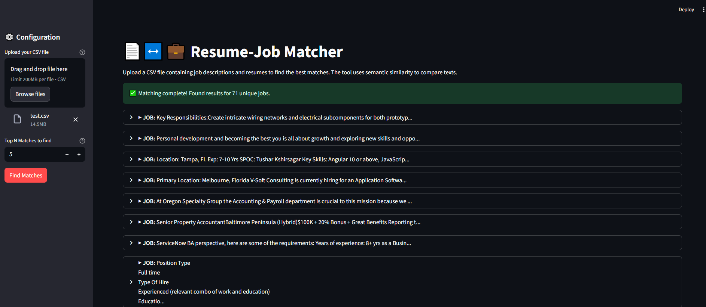

# AI Internship Matchmaker POC 🤖

A Proof of Concept demonstrating an AI-powered engine to intelligently match candidates with internships, designed for the Prime Minister's Internship Scheme (PMIS).

This project showcases the power of semantic search to move beyond keywords and understand the true contextual alignment between a candidate's experience and an internship's requirements.

[View Sample pdf with top matching resumes for a job](images/Resume-Job%20Matcher_sample.pdf)



---

## Table of Contents
* [The Big Picture: The Problem](#the-big-picture-the-problem)
* [The Proposed Solution](#the-proposed-solution)
* [About This Proof of Concept (POC)](#about-this-proof-of-concept-poc)
* [Technology Stack](#technology-stack)
* [Getting Started](#getting-started)
  * [Prerequisites](#prerequisites)
  * [Installation & Usage](#installation--usage)
* [How It Works](#how-it-works)
* [Future Roadmap](#future-roadmap)

---

## The Big Picture: The Problem
The Prime Minister's Internship Scheme (PMIS) is a national initiative aiming to provide one crore internships. However, early phases have shown a critical **efficacy gap**. Despite a large number of applications, the final joining rate was a mere **7% of available positions**.

The root cause is a systemic **"Great Mismatch"** stemming from:
* **Superficial Matching:** The current system relies on basic keyword matching, failing to understand the nuances of skills and roles.
* **Geographic & Economic Barriers:** Opportunities are concentrated in cities, creating barriers for rural candidates.
* **Lack of Transparency:** Candidates often apply without full information, leading to high offer rejection rates.

---

## The Proposed Solution
The ultimate goal is to build an **AI-Based Smart Allocation Engine**—an intelligent marketplace that addresses these challenges through three core pillars:

1.  **Semantic Matching with NLP:** An advanced Natural Language Processing (NLP) module performs deep semantic analysis of resumes and internship descriptions, moving beyond keywords to understand the true context of skills and responsibilities.
2.  **Hybrid Recommendation Engine:** A combination of content-based and collaborative filtering techniques generates a multi-factor "Match Score" for each candidate-internship pair.
3.  **Fair Allocation Module:** A constrained optimization framework ensures equitable distribution of opportunities across all states, districts, and social categories, aligning with national policy goals.


---

## About This Proof of Concept (POC)
This repository contains a lightweight, functional Proof of Concept. **It is not the final, full-scale application.**

The purpose of this POC is to demonstrate the feasibility and power of the most critical component: **the Semantic Matching Engine**.
we are using an already good working S-BERT model for inference and vector embeddings generation. we will fine tune the model furthur for our needs later. 

### What this POC does:
* Provides a simple web interface using **Streamlit**.
* Takes raw text from a resume and a job description as input.
* Uses a pre-trained **Sentence-BERT (S-BERT)** model to convert the texts into contextual vector embeddings(although this interface doesnt use our main algorithm like the ranker.py).
* Calculates and displays a **semantic similarity score** that represents the true alignment between the two texts.
* it also has another (main) script `ranker.py` , which takes a csv with different resumes and job descriptions , and matches top 5 resume for each job description.

### What this POC does NOT include:
* User accounts or a database.
* A hybrid recommendation system (it only uses content-based semantic matching).
* The Fair Allocation Module.
* A scalable, production-ready architecture.

---

## Technology Stack
* **Language:** Python 3.9+
* **Web Framework:** Streamlit
* **AI/ML Libraries:**
    * `sentence-transformers` (from Hugging Face) for the S-BERT model.
    * `torch` (PyTorch) as the backend for the transformer model.

---

## Getting Started

### Prerequisites
* Python 3.9 or higher installed.
* `pip` and `venv` installed.
* you might get some error if your system doesnt meet some requirements.. it is reccemended to use a gpu with atleast 4gb vram or equivalent iGPU and a considerably powerful CPU
* if you are using gpu , make sure CUDA >= 12.9 is supported and installed
### Installation & Usage

1.  **Clone the repository:**
    ```bash
    git clone [https://github.com/your-username/your-repo-name.git](https://github.com/your-username/your-repo-name.git)
    cd your-repo-name
    ```

2.  **Create and activate a virtual environment:**
    * On macOS/Linux:
        ```bash
        python3 -m venv venv
        source venv/bin/activate
        ```
    * On Windows:
        ```bash
        python -m venv venv
        .\venv\Scripts\activate
        ```

3.  **Install the required packages:**
    ```bash
    pip install -r requirements.txt
    ```


4. **Run the Streamlit application : (use may try the sample `text.csv` file for this when app opens)** 
    ```bash
    streamlit run ranker.py
    ```
5.  **you can also manually give resume and job description to see match score individually through this script: (although the percentage isnt much relevant as compared to the ranker script .. this doesnt work as good as the ranker):**
    ```bash
    streamlit run app.py
    ```
    Your web browser will automatically open with the running application.

 

---

## How It Works
The magic behind this POC is a technique called **semantic embedding**.

1.  **Embedding:** The S-BERT model reads a piece of text (like "developed a customer churn prediction model") and converts it into a list of numbers called a vector or an "embedding." This vector represents the text's location in a high-dimensional "meaning space." Think of it as a GPS coordinate for a concept.
2.  **Comparison:** The application generates one vector for the resume and another for the job description.
3.  **Similarity Score:** It then calculates the **Cosine Similarity** between these two vectors. This measures the angle between them. A smaller angle means the concepts are pointing in the same direction, resulting in a higher match score.

This is why the model knows that "customer churn" and "customer attrition" are nearly the same concept, even though the words are different.

---

## Future Roadmap
This POC is the first step. The path to the full solution includes:
* [ ] **Phase 1: Full UI/UX Development:** Build out the three dedicated portals for Candidates, Companies, and Administrators.
* [ ] **Phase 2: Hybrid Recommendation Engine:** Integrate collaborative filtering to provide "people like you also applied for..." recommendations.
* [ ] **Phase 3: Fair Allocation Module:** Implement the constrained optimization layer to ensure policy adherence for regional and demographic quotas.
* [ ] **Phase 4: Scalable Deployment:** Architect the system on a cloud platform (AWS/Azure/GCP) using a microservices architecture for national-level scale.