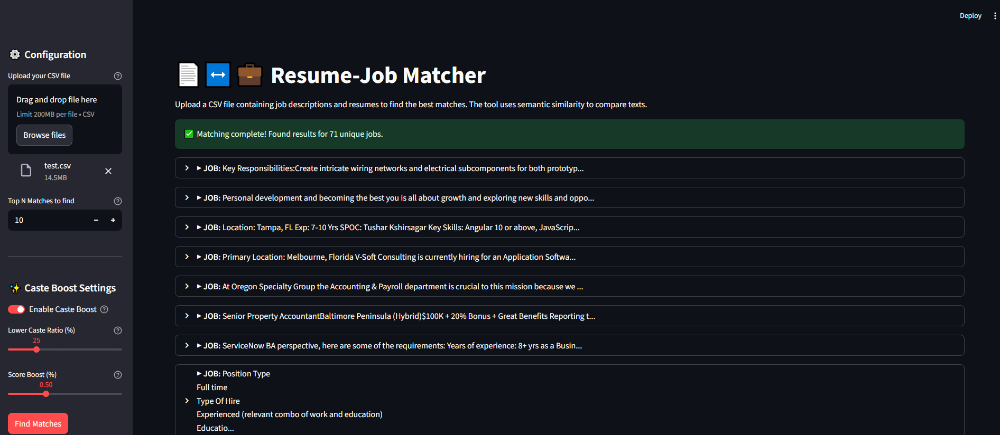

# AI Internship Matchmaker POC 🤖

A Proof of Concept demonstrating an AI-powered engine to intelligently match candidates with internships, designed for the Prime Minister's Internship Scheme (PMIS).

This project showcases the power of semantic search to move beyond keywords and understand the true contextual alignment between a candidate's experience and an internship's requirements.

[View Sample pdf with top matching resumes for a job](images/Resume-Job%20Matcher_sample.pdf)



[Click here to see complete implementation plan](https://docs.google.com/document/d/1gIHepHXndfihwbHj3PEIpQNwNvi_LDJ7T0cFRwoNRbA/edit?usp=sharing)

---

## Table of Contents
* [The Big Picture: The Problem](#the-big-picture-the-problem)
* [The Proposed Solution](#the-proposed-solution)
* [About This Proof of Concept (POC)](#about-this-proof-of-concept-poc)
* [Technology Stack](#technology-stack)
* [Getting Started](#getting-started)
  * [Prerequisites](#prerequisites)
  * [Installation & Usage](#installation--usage)
* [How It Works](#how-it-works)
* [Future Roadmap](#future-roadmap)

---

## The Big Picture: The Problem
The Prime Minister's Internship Scheme (PMIS) is a national initiative aiming to provide one crore internships. However, early phases have shown a critical **efficacy gap**. Despite a large number of applications, the final joining rate was a mere **7% of available positions**.

The root cause is a systemic **"Great Mismatch"** stemming from:
* **Superficial Matching:** The current system relies on basic keyword matching, failing to understand the nuances of skills and roles.
* **Geographic & Economic Barriers:** Opportunities are concentrated in cities, creating barriers for rural candidates.
* **Lack of Transparency:** Candidates often apply without full information, leading to high offer rejection rates.

---

## The Proposed Solution
The ultimate goal is to build an **AI-Based Smart Allocation Engine**—an intelligent marketplace that addresses these challenges through three core pillars:

1.  **Semantic Matching with NLP:** An advanced Natural Language Processing (NLP) module performs deep semantic analysis of resumes and internship descriptions, moving beyond keywords to understand the true context of skills and responsibilities.we will use a Bi-encoder model to generate embeddings and get top N matches for each Job description , then a Cross-Encoder model to then reRank the mapped resume of each Job description for a much better accuracy.
2.  **Hybrid Recommendation Engine:** A combination of content-based and collaborative filtering techniques generates a multi-factor "Match Score" for each candidate-internship pair.
3.  **Fair Allocation Module:** A constrained optimization framework ensures equitable distribution of opportunities across all states, districts, and social categories, aligning with national policy goals.


---

## About This Proof of Concept (POC)
This repository contains a lightweight, functional Proof of Concept. **It is not the final, full-scale application.**

The purpose of this POC is to demonstrate the feasibility and power of the most critical component: **the Semantic Matching Engine**.
we have finetuned a S-BERT model for inference and vector embeddings generation.we used a triplet loss function, with Job Descriptions as the anchor, and one positive and one negative resume for it.Though we are working on furthur using a custom quadruplet loss func for the model to better understand nuances of different resumes. 


### What this POC does:
* Provides a simple web interface using **Streamlit**.
* Takes raw text from a resume and a job description as input.
* Uses a finetuned **Sentence-BERT (S-BERT)** model to convert the texts into contextual vector embeddings(although this interface doesnt use our main algorithm like the ranker.py). and a Cross-Encoder to rerank the resumes after matching.
* Calculates and displays a **semantic similarity score** that represents the true alignment between the two texts.
* it also has another (main) script `ranker.py` , which takes a csv with different resumes and job descriptions , and matches top N resume for each job description.
* the ranker also considers the caste. it gives certain boost to people belonging to a lower caste. we randomize it with some paramaters for now

### What this POC does NOT include:
* User accounts or a database.
* A hybrid recommendation system (it only uses content-based semantic matching).
* The Fair Allocation Module.(partially implemented for the POC)
* A scalable, production-ready architecture.

---

## Technology Stack
* **Language:** Python 3.9+
* **Web Framework:** Streamlit
* **AI/ML Libraries:**
    * `sentence-transformers` (from Hugging Face) for the S-BERT model.
    * `torch` (PyTorch) as the backend for the transformer model.

---

## Getting Started

### Prerequisites
* Python 3.9 or higher installed.
* `pip` and `venv` installed.
* you might get some error if your system doesnt meet some requirements.. it is reccemended to use a gpu with atleast 4gb vram or equivalent iGPU and a considerably powerful CPU
* if you are using gpu , make sure CUDA >= 12.9 is supported and installed
* download our trained model [Model](https://drive.google.com/drive/folders/1Ei0tnh1OGvIz0FyB7NRLc4PeP8cX2EcE?usp=sharing) for better results , or set BI_ENCODER_MODEL_PATH in `ranker.py` to `Leo1212/longformer-base-4096-sentence-transformers-all-nli-stsb-quora-nq`
### Installation & Usage

1.  **Clone the repository:**
    ```bash
    git clone https://github.com/Bhaskar-kumar-arya/resume-job-matchmaker.git
    cd your-repo-name
    ```

2.  **Create and activate a virtual environment:**
    * On macOS/Linux:
        ```bash
        python3 -m venv venv
        source venv/bin/activate
        ```
    * On Windows:
        ```bash
        python -m venv venv
        .\venv\Scripts\activate
        ```

3.  **Install the required packages:**
    ```bash
    pip install -r requirements.txt
    ```


4. **Run the Streamlit application : (use may try the sample `text.csv` file for this when app opens)** 
    ```bash
    streamlit run ranker.py
    ```
5.  **you can also manually give resume and job description to see match score individually through this script: (although the percentage isnt much relevant as compared to the ranker script .. this doesnt work as good as the ranker):**
    ```bash
    streamlit run app.py
    ```
    Your web browser will automatically open with the running application.

 

---

## How It Works
The magic behind this POC is a technique called **semantic embedding**.

1.  **Embedding:** The S-BERT model reads a piece of text (like "developed a customer churn prediction model") and converts it into a list of numbers called a vector or an "embedding." This vector represents the text's location in a high-dimensional "meaning space." Think of it as a GPS coordinate for a concept.
2.  **Comparison:** The application generates one vector for the resume and another for the job description.
3.  **Similarity Score:** It then calculates the **Cosine Similarity** between these two vectors. This measures the angle between them. A smaller angle means the concepts are pointing in the same direction, resulting in a higher match score.

This is why the model knows that "customer churn" and "customer attrition" are nearly the same concept, even though the words are different.

---

## Future Roadmap
This POC is the first step. The path to the full solution includes:
1. **Phase 1: Full UI/UX Development:** Build out the three dedicated portals for Candidates, Companies, and Administrators. : 
    * Candidate Portal: A user-centric dashboard where candidates can build profiles, receive personalized internship recommendations with a clear "Match Score," and use an   "Explain this Match" feature for transparency. Advanced filters for location, stipend, and sector will empower candidates to make informed choices.
    * Company Portal: An efficient tool for HR managers to post opportunities and receive an AI-powered, ranked list of the most suitable candidates. The portal will include match explanations and workflow management tools to streamline the hiring process.
    * Administrator Portal: A strategic dashboard for government officials to monitor Key Performance Indicators (KPIs) in real-time. It will feature dedicated analytics to track the distribution of internships across demographic groups and regions, ensuring national policy goals are met.
2. **Phase 2: Hybrid Recommendation Engine:** Integrate collaborative filtering to provide "people like you also applied for..." recommendations. : 
    * Collaborative Filtering: By analyzing the application history of the entire user community, this layer will identify latent patterns. It will enable "people like you also applied for..." recommendations, helping candidates discover novel and serendipitous opportunities they might have otherwise missed.
    * Match Score = Summation (aScore_Content + (1-a)Score_Collaborative)
3. **Phase 3: Fair Allocation Module:** Implement the constrained optimization layer to ensure policy adherence for regional and demographic quotas. : 
    * Affirmative Action: Ensuring that the number of positions allocated to candidates from protected groups (SC, ST, OBC, PwD) meets or exceeds government-defined quotas.
    * Regional Equity: Enforcing targets for the distribution of internships across all states and aspirational districts to prevent geographic imbalances and promote balanced national development
    * Industry Capacity: Guaranteeing that no company is allocated more interns than its stated capacity for a given role.
4. **Phase 4: Scalable Deployment:** Architect the system on a cloud platform (AWS/Azure/GCP) using a microservices architecture for national-level scale. : 
    * Cloud Architecture: Architecting the entire system on a major cloud platform (like AWS, Azure, or GCP) using a microservices architecture. This will ensure high availability, fault tolerance, and the ability to handle millions of users.
    * Containerization: Using technologies like Docker and Kubernetes to manage and orchestrate the various services, allowing for seamless scaling and updates.
    * MLOps Pipeline: Implementing a comprehensive Machine Learning Operations (MLOps) pipeline for continuous model monitoring, evaluation, and retraining. This ensures the AI models remain accurate and adapt to new data and trends over time without manual intervention.